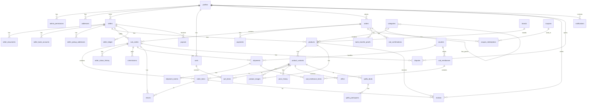

# Kaaravan Database Schema

This document contains the Entity Relationship Diagram (ERD) for the Kaaravan platform.

```mermaid
erDiagram
  profiles ||--o{ admin_permissions: has
  profiles ||--o{ addresses: has
  profiles ||--o{ sellers: owns
  profiles ||--o{ carts: has
  profiles ||--o{ orders: places
  profiles ||--o{ reviews: writes
  profiles ||--o{ disputes: opens
  profiles ||--o{ notifications: receives
  
  sellers ||--o{ seller_documents: has
  sellers ||--o{ seller_bank_accounts: has
  sellers ||--o{ seller_pickup_addresses: has
  sellers ||--o{ products: lists
  sellers ||--o{ sub_orders: fulfills
  sellers ||--o{ seller_ledger: has
  sellers ||--o{ payouts: receives
  
  categories ||--o{ categories: has_parent
  categories ||--o{ products: contains
  
  brands ||--o{ products: brands
  
  products ||--o{ product_variants: has
  products ||--o{ product_images: has
  products ||--o{ reviews: receives
  
  product_variants ||--o{ product_images: has
  product_variants ||--o{ cart_items: in
  product_variants ||--o{ order_items: in
  product_variants ||--o{ price_history: has
  product_variants ||--o{ offers: receives
  product_variants ||--o{ qafila_deals: in
  
  carts ||--o{ cart_items: contains
  
  orders ||--o{ sub_orders: contains
  orders ||--o{ payments: has
  orders ||--o{ coupon_redemptions: has
  orders ||--o{ bank_transfer_proofs: has
  orders ||--o{ cod_confirmations: has
  
  sub_orders ||--o{ order_items: contains
  sub_orders ||--o{ order_status_history: has
  sub_orders ||--o{ commissions: pays
  sub_orders ||--o{ shipments: has
  sub_orders ||--o{ returns: has
  sub_orders ||--o{ disputes: has
  
  couriers ||--o{ shipments: handles
  couriers ||--o{ cod_remittances: remits
  
  shipments ||--o{ shipment_events: has
  shipments ||--o{ cod_remittance_items: in
  
  cod_remittances ||--o{ cod_remittance_items: contains
  
  order_items ||--o{ returns: in
  order_items ||--o{ reviews: for
  
  coupons ||--o{ coupon_redemptions: used_in
  
  qafila_deals ||--o{ qafila_participants: has
```
